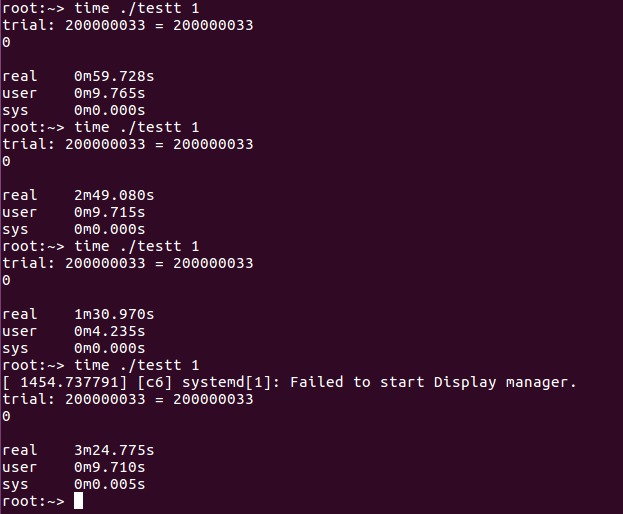
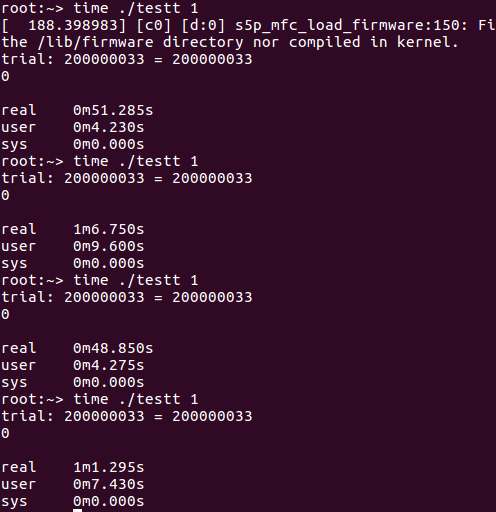

# Project 03

# Weighted Round-Robin Scheduler

# Introduction
The objective of this project is to implement new scheduler policy, weighted round-robin. Also we have to adjust it on our ARTIK device's kernel. The weighted round-robin scheduler gives weight for every tasks which are following wrr policy. The weight ranges between 1 and 20. The task can hold the cpu for weight * 10ms time. And also in every 2 seconds, load of each cpu have to be rebalanced. The heaviest loaded cpu should give the heaviest task to light weighted cpu. By implementing whold scheduler, we can understand how the kernel scheduler works and how the scheduler can be implemented.

# Implementation
## 1. `sched_wrr_entity` definition
We made definition of `sched_wrr_entity` in `include/linux/sched.h`, and added it in `struct task_struct`.

```c
struct sched_wrr_entity {
	struct list_head run_list;
	unsigned int weight; 	 /* default weight = 10, [1,20] */
	unsigned int time_slice; /* default time slice = 10 * 10ms = 100ms */
	unsigned int tick_left;  /* left # of tick count */
	unsigned int movable;	 /* if(not running && in queue) 1 else 0 */
};
```
`run_list` consists of another sched_wrr_entities.
`weight` is the value which determines `time_slice` of the task. `weight`should be in [1,20] range.
`time_slice` is the value which indicates the length of time which the task can hold the processor in it's turn.
`tick_left` is the value which indicates the left count of cpu tick.
`movable` indicates that the task is movable to another running queue or not. If the task isn't running and in queue, the value is 1. Else the value is 0.


## 2. `wrr_rq` definition
We made definition of `wrr_rq` in `kernel/sched/sched.h`, and added it in `rq`.

```c
struct wrr_rq {
	struct list_head queue_head;
	unsigned long sum_weight;
};
```
`queue_head` is head of the queue which consists of tasks in wrr run queue.
`sum_weight` is sum of all tasks' weight which are in the queue.

## 3. `wrr_sched_class` implementation
To implement new scheduling policy, we have to make sure that all functions of struct sched_class are appropriately implemented. There are 20 functions in sched_class, and we implemented 10 of them in our `wrr_sched_class` and left another 10 by skeleton.


* `enqueue_task_wrr` decides the task should be enqueued or not. And if it should be, then hang the task's sched_wrr_entity at `queue_head`'s tail which is in `wrr_rq`.
* `dequeue_task_wrr` deletes the task's `sched_wrr_entity` from `wrr_rq`.
* `yield_task_wrr` moves the first task in queue to the tail.
* `pick_next_task_wrr` picks the next task in queue which is at the head of the queue.
* `put_prev_task_wrr` makes the current task pause and modify it's `movable` by 1.
* `select_task_rq_wrr` selects a cpu which has the lowest sum of weight.
* `set_cpus_allowed_wrr` returns # of cpus which the task is allowed to move in.
* `set_curr_task_wrr` modify current task's `movable` value by 0, which means it's not movable.
* `task_tick_wrr` calculates the remain # of `tick_left` and decides the task to reschedule or not.
* `get_rr_interval` transforms time_slice into initial `tick_left` value.

With these functionalities above, we've made definition of `wrr_sched_class`. We modified `next` to `fair_sched_class`, because fair policy run queue have less priority than wrr run queue.

```c
const struct sched_class wrr_sched_class = {
	.next		= &fair_sched_class,
	.enqueue_task	= enqueue_task_wrr,
	.dequeue_task	= dequeue_task_wrr,
	...
};
```
## 4. Load Balancing
### 4-1. `hrtimer`
`hrtimer` is struct that we used to call `load_balance` every 2 seconds.
In entire system, only one timer(`struct hrtimer`) counts `system_time`.  
In `core.c`, `init_wrr_hrtimer` is called in `sched_init` and `start_wrr_hrtimer` is called in `sched_init_smp`. So timer starts. `ktime_t`(how long period we want) is made 2 seconds. In every 2 seconds, call-back-function(`call_load_balance_wrr`) is called. 
### 4-2. `load_balance_wrr` implementation
`load_balance_wrr` is called by `hrtimer` every 2 seconds.
first, We have to find `max_rq`(source cpu), `min_rq`(destination cpu).
and also we have to find heaviest among `task_struct` which might able to move into `min_cpu`(see cpumask, movable...) from `max_cpu`. And this task shouldn't cause the weight order to be reversed.

## 5. `get_weight()`, `set_weight()`
We use `find_process_by_pid`, `task_rq_lock`, `check_same_owner` in `sched_setweight`. Those function is static in `core.c`. So we implemented `sched_setweight`, `sched_getweight` in `core.c`. and system calls are implemented in `sched.c`
`sched_getweight` is protected by `rcu_read_lock`.
`sched_setweight` is protected by `task_rq_lock`.

## 6. Improve
We used aging-concept. If the task is getting order, scheduler makes it's weight heavier. (e.g. weight++)(1<= weight <= 20). So old process's weight will keep increase until 20. It'll help old process to be terminated earlier than another young processes, and that will make waiting time of the old task slightly shorter.

We placed all of kernel sources of our improved version on [proj3_improved](https://github.com/swsnu/os-team7/tree/proj3_improved) branch.

```c
static void update_curr_wrr(struct rq *rq){
	
	struct task_struct *curr = rq->curr;
	// struct sched_wrr_entity *wrr_se = &(curr->wrr);
	u64 delta_exec;
	u64 real_age;
	...
	real_age = curr->se.sum_exec_runtime;
	do_div(real_age , 1000000000);

	if(curr->wrr.age < real_age){ // aged by 1 second
		curr->wrr.age = real_age;
		if(curr->wrr.weight < 20){
			curr->wrr.weight++;
			curr->wrr.time_slice = curr->wrr.weight*QUANTUM;
			rq->wrr.sum_weight++;
		}
	}
}
```
We've done a simple experiment to investigate benefit of aging approach. First, wrr policy without aging, we ran a process(`./trial 200000033`) with weight 1 and 10 other infinite loop processes which are weight 20. We measured how long does it take to done the trial process. The result is below.

The result is around 2 to 3 minutes.

We've done same experiment with aging wrr policy. The result is below.

The result has dramatically improved, which is around less then 1 minute. As you can see, "aging" wrr policy can reduce the long-time-consuming process's execution time compare to default wrr policy. 

# Investigation
We've tested our scheduler's functionality for various task weight(1~20). Testing environment is below.

* 10 busy loop processes are running on background.
* execute [testset](test/testset.c) and check for running time by time command.
* `testset` is a program which get an argument from user(weight) and execute both `trial` and `setweight` to make `trial` run in various weights (using `fork` and `execv`)
* the output time is not stable, so we've tried every 20 kinds of weight cases(1~20) for three times and get average from that three values. 

```
./inf &
./inf &
...
./inf &
time ./testset 20
```
We've drawn a simple graph by the data. The graph shows us inverse proportion between weight and running time of the task. If you want to know about details, please check [plot.pdf](plot.pdf) file.


# Lessons Learned
## How scheduling works
We've already learnt about concepts of scheduling, and methodologies of scheduling : FIFO, SJF, RR, etc. But there was no chance to know how really scheduler works and manages all tasks in the device. By implementing wrr scheduler, we had to look around another kernel schedulers : cfs and rt. By reading the code, we could know some common characteristics of kernel scheduler : using tick concept, priority thingies, group scheduling, and so on. 

## How to implement new scheduler
We've learnt that `Struct sched_class` is pretty handy modulation. Like many other OOP languages, almost all main functions were modulated by `sched_class` structure. What we had to do was just make skeleton according to the sched_class and fill it one by one. Finally, we modified some parts of `sched.h` and `core.c`. That was all. We could create brand-new scheduler by just staying all night for few days.

## How to improve the scheduler
After the implementation, we've thought about how to improve the scheduler. There were some methodologies, and what we chose is aging approach. If there is a huge work-loaded task and small tasks are keep coming in to the run queue, the huge task cannot end it's workload in short time. But by valuing their ages and give them little more privilige, we can make sure that even huge task can complete their job in understandable time.

# Thank you.
